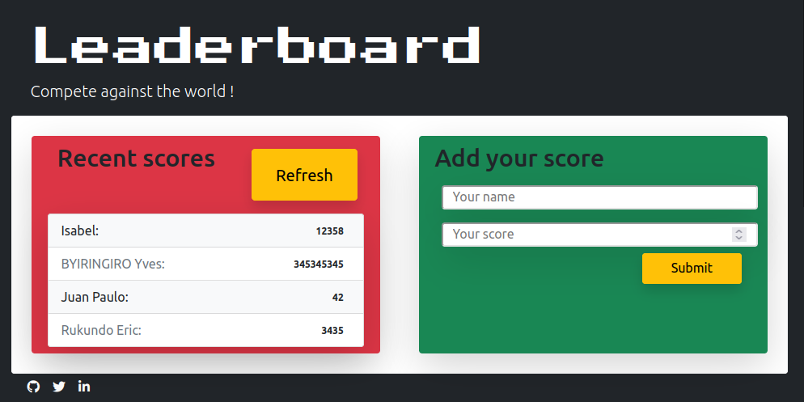
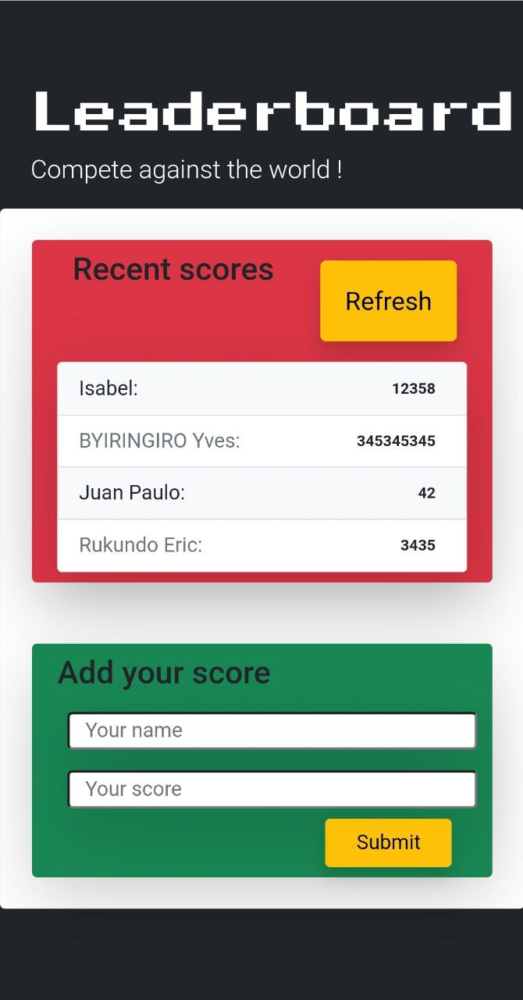

# Project Name

> The leaderboard website displays scores submitted by different players. It also allows you to submit your score. All data is preserved thanks to the external Leaderboard API service. Built with HTML, CSS, JS, Webpack and Bootstrap.

It's also mobile friendly!

Solo project for [Microverse](https://www.microverse.org/?grsf=6h9fw6)

## Built With

- HTML 5
- CSS
- JavaScript
- Webpack
- VS Code
- Bootstrap
- Gitflow

## Live Demo

[Live Demo Link](https://maclenn77.github.io/Leaderboard/)

## Getting Started

**Clone this repo for develop your own project!**

To get a local copy up and running follow these simple example steps.

### Prerequisites

- Chrome Browser (recommended)
- Node.js
- A friend to play with!

### Setup

- Clone the repo with `git clone git@github.com:Maclenn77/Leaderboard.git`

### Install

- Run `npm install`

## Authors

👤 **Author1**

- GitHub: [@Maclenn77](https://github.com/Maclenn77)
- Twitter: [@SrJuanPapas](https://twitter.com/SrJuanPapas)
- LinkedIn: [Juan Paulo Pérez Tejada](https://linkedin.com/in/juanpaulopereztejada)

## 🤝 Contributing

Contributions, issues, and feature requests are welcome!

Feel free to check the [issues page](https://github.com/Maclenn77/Leaderboard/issues).

## Show your support

Give a ⭐️ if you like this project!

## Acknowledgments

- Hat tip to anyone whose code was used
- Inspiration
- etc

## 📝 License

This project is [MIT](./MIT.md) licensed.
